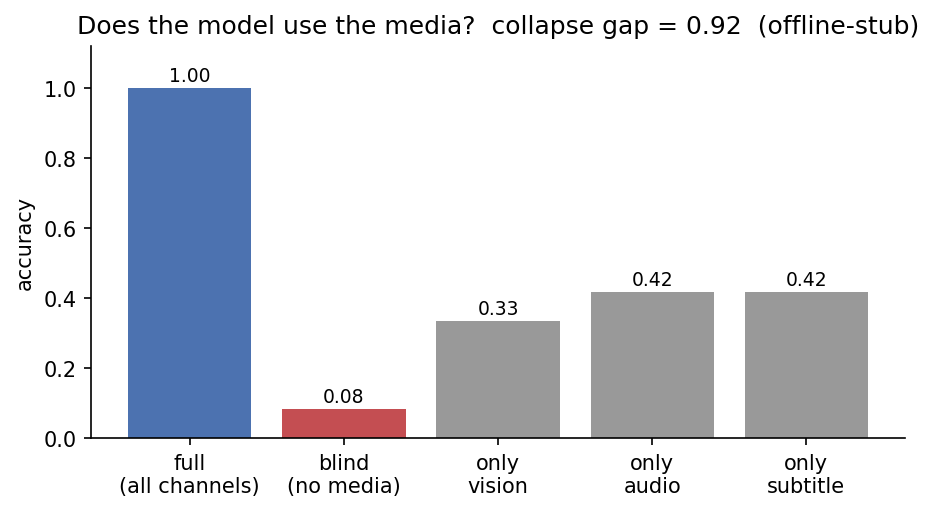
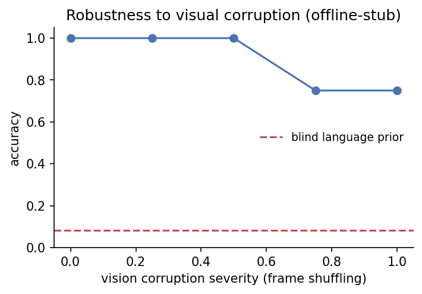

# Video Modality Diagnostics

**A model-agnostic harness for measuring modality usage and collapse in multimodal
QA.** Multimodal models often answer from the *language prior* alone — question/option
wording — while ignoring the other input channels ("modality collapse"). `vmd`
measures this directly:

- **Blind baseline** — accuracy with *all* media removed. If it is close to the full
  accuracy, the model isn't using the media channels. The difference is the **collapse gap**.
- **Modality ablations** — leave-one-out and single-modality accuracy per channel
  (vision / audio / subtitles).
- **Modality contribution** — the accuracy drop when each channel is removed.
- **Robustness probes** — accuracy under graded corruption (frame shuffling, token
  noise) of a single channel.

Any model is plugged in through a 1-method `Backend` interface
(`answer(item, view) -> option index`); the diagnostic only controls *which evidence
channels the backend is allowed to see*.

> **Scope, stated upfront.** The modality channels in this repo are *textual evidence
> proxies* (visual facts, audio tags, subtitles) standing in for raw frames and audio.
> That is a deliberate trade-off: it makes the harness cheap, deterministic, and
> runnable in CI against any chat LLM — and it means the harness measures **channel
> usage and collapse**, not visual perception — and it is complemented by a
> **frame-level backend**: `VLMVideoBackend` runs a video VLM (Qwen2.5-VL) on real
> sampled frames over a NExT-QA subset, turning the same metrics into end-to-end
> video measurements (see *Real video* below).

**Tech report**: the full study — method, per-question-type results and limitations —
is written up in [`paper/report.pdf`](paper/report.pdf) (*Watching Without Seeing Time:
a per-question-type ablation of modality usage in a video–language model*).

## Quick start (offline, no GPU)

```bash
pip install -e ".[dev]"
pytest -q                          # full test suite, CPU-only, seconds
python scripts/run_diagnostic.py   # diagnostic on the sample VideoQA set
```

Output on the bundled 12-item sample with the **offline stub backend**:

```
full accuracy            : 1.000
blind language prior     : 0.083
collapse gap (full-blind): 0.917

modality contribution    : audio +0.333 | subtitle +0.333 | vision +0.250
vision robustness        : 1.00 / 1.00 / 1.00 / 0.75 / 0.75  (severity 0 → 1)
```

> **Honest note.** The stub is a *simulated* model designed to genuinely use the gold
> modality (and to collapse to the language prior when that channel is ablated or
> heavily corrupted). The numbers above validate the *methodology* end-to-end — they
> are not a measurement of a real model. For real measurements, run the Colab
> notebook below.

`python scripts/plot_results.py` renders the diagnostic as figures:



*Left to right: full accuracy, blind (no media) baseline, and each single-modality
ablation. A large gap between "full" and "blind" means the model genuinely uses
the media; the stub collapses to 0.08 without it.*



*Accuracy as the visual channel is progressively corrupted (frame shuffling).
The stub tolerates corruption up to its threshold (0.5), then the vision-dependent
questions fall back to the language prior.*

## Real model (Colab, GPU)

```bash
pip install -e ".[vlm]"
python scripts/run_diagnostic.py --backend hf --model Qwen/Qwen2.5-1.5B-Instruct
```

or open `notebooks/diagnostics_colab.ipynb`
([Colab](https://colab.research.google.com/github/mlahozy21/video-modality-diagnostics/blob/main/notebooks/diagnostics_colab.ipynb)) —
it runs the full diagnostic with a real Hugging Face chat model on a free T4.
The evidence channels are textual (visual facts / audio tags / subtitles), so any
instruct LLM can be diagnosed; a true end-to-end video VLM only needs a `Backend`
subclass that consumes raw frames and audio.

### Measured: Qwen2.5-1.5B-Instruct

| Metric | Value |
|---|---:|
| Full accuracy | 0.583 |
| Blind language prior | 0.083 |
| **Collapse gap** | **0.500** |
| Contribution: vision | +0.417 |
| Contribution: subtitle | +0.250 |
| Contribution: audio | +0.167 |

The model genuinely uses the media (large collapse gap), leaning most on the visual
channel. Two honest observations: (1) single-modality accuracy is low (0.08–0.25) —
with only one channel present the model often refuses to commit or follows the
distractor; (2) accuracy *rises* slightly under frame-shuffle corruption
(0.58 → 0.75): **token shuffling preserves the bag of words**, so for textual
evidence channels this probe measures word-order sensitivity rather than content
removal — use the `noise` (token-drop) corruption, or a frame-level VLM backend,
to measure true content degradation.

## Real video: a VLM on NExT-QA frames

`src/vmd/video.py` implements the frame-level path: uniform frame sampling from the
.mp4 (OpenCV), **frame-sequence corruptions** — temporal `shuffle` (destroys order,
preserves content: the video analogue of token shuffling) and `drop` (destroys
content) — and `VLMVideoBackend` (Qwen2.5-VL-3B by default). The metrics, ablation
grid and reports are reused unchanged; on this subset the gold modality is vision,
so the diagnostic reduces to its headline numbers: **collapse gap** (frames vs no
frames) and the two robustness curves.

```bash
pip install -e ".[video]"
python scripts/prepare_nextqa.py --n 60      # NExT-QA MC subset + its videos
```

then run `notebooks/video_vlm_colab.ipynb`
([Colab](https://colab.research.google.com/github/mlahozy21/video-modality-diagnostics/blob/main/notebooks/video_vlm_colab.ipynb))
on a GPU runtime (~30–40 min on an L4 for n=60, inference only).

### Measured: Qwen2.5-VL-3B on real NExT-QA frames

n = 240 (30 per question type, balanced), 8 uniformly sampled frames, inference only:

| Metric | Accuracy |
|---|---:|
| Full accuracy (8 frames) | 0.625 |
| Blind (no frames) | 0.433 |
| **Collapse gap** | **0.192** |
| Shuffle 50% of frames | 0.625 |
| Shuffle 100% of frames | 0.650 |
| Drop 50% of frames | 0.592 |
| Drop 75% of frames | 0.600 |

Per question group (C = causal, T = temporal, D = descriptive):

| Group | n | Full | Blind | **Gap** | Shuffle 100% | Δ shuffle | Drop 75% | Δ drop |
|---|---:|---:|---:|---:|---:|---:|---:|---:|
| Causal | 60 | 0.600 | 0.400 | **+0.200** | 0.650 | +0.050 | 0.567 | −0.033 |
| Temporal | 90 | 0.511 | 0.478 | **+0.033** | 0.533 | +0.022 | 0.511 | +0.000 |
| Descriptive | 90 | 0.756 | 0.411 | **+0.344** | 0.767 | +0.011 | 0.711 | −0.044 |

Three findings:

1. **The language prior is large**: blind accuracy is 0.433 on 5-way MC (chance:
   0.20). Almost half of this benchmark slice is answerable without the video.
2. **What the video adds is *descriptive*, not *temporal*.** Frames buy +0.344 on
   descriptive questions and +0.200 on causal ones — but only **+0.033 on temporal
   questions**, the very category where watching the video should matter most. On
   temporal QA the model is barely better than its own language prior.
3. **Temporal order is never used, and few frames suffice.** Fully shuffling the
   frame order changes nothing in any group (Δ within noise, even slightly
   positive), and dropping 75% of the frames costs at most ~0.04. Qwen2.5-VL-3B
   behaves as a *bag-of-frames* model on NExT-QA — the single-frame / temporal-
   collapse bias reported in the VideoQA literature, here isolated per question
   type with one ablation grid.

Per-item predictions for every configuration are saved by the notebook
(`records_video.json`), so further breakdowns need no re-inference.

## How it works

```
QAItem (question, options, per-modality evidence, gold modality)
        │
make_view(modalities, corruption)   # which channels the model may see
        │
Backend.answer(item, view)          # your model
        │
run_diagnostic(...)                 # full / leave-one-out / single / blind / robustness
        │
format_report(...)                  # readable summary
```

- `vmd/data.py` — `QAItem` schema + JSONL loader (each item declares which modality
  holds the answer: `gold_modality`).
- `vmd/modalities.py` — channel selection and corruption operators (token shuffle,
  token drop-noise, full channel drop).
- `vmd/diagnose.py` — the experiment grid; returns a plain dict of metrics.
- `vmd/metrics.py` — accuracy, per-modality contribution, collapse gap.
- `vmd/backends.py` — `OfflineStubBackend` (deterministic, CI-friendly) and
  `HFChatBackend` (real model).

## Repository structure

```
.
├── README.md  LICENSE  pyproject.toml  .gitignore
├── src/vmd/                 # library (no hard dependencies)
│   └── video.py             # frame sampling, frame corruptions, VLM backend
├── data/sample/videoqa.jsonl  # 12-item balanced sample (4 per gold modality)
├── scripts/
│   ├── run_diagnostic.py    # CLI: stub or real HF backend
│   ├── plot_results.py      # render the diagnostic as figures
│   └── prepare_nextqa.py    # build the real-video NExT-QA subset
├── figures/                 # generated plots (committed for the README)
├── notebooks/
│   ├── diagnostics_colab.ipynb   # textual channels, real LLM
│   └── video_vlm_colab.ipynb     # real frames, Qwen2.5-VL on NExT-QA
├── paper/                   # tech report (LaTeX + PDF + figures)
└── tests/                   # offline, deterministic, run in CI
```

## Roadmap

- **Audio channel for real video** — extend `VLMVideoBackend` with an audio-capable
  model so the full three-channel ablation grid runs end to end on real media.
- **Content-removing corruption for text channels** — the `noise` (token-drop)
  operator as default for robustness curves on textual proxies, since `shuffle`
  preserves the bag of words (see the measured observation above).

## License

Released under the MIT License — see `LICENSE`.
